# 正题部分

## 实验目的

通过使用技术手段，实现地理信息的可视化，方便进行后续的数据分析与处理。

本次实验使用PyCharm开发环境，借助开源库Pyecharts实现疫情数据可视化，包括全国累计确诊人数、现存确诊人数、累计治愈人数、死亡人数、全国各地市的确诊人数以及疫情发生以来，湖北省和全国其他地区的确诊人数变化图。

## 实验过程

### **收集数据**

通过查找资料，发现了很多数据源，但是大多数的数据源都不是原始数据，存在一些合并的现象，比如，将每日的数据进行累计，当然，每种处理数据的方式各有各的好处，但是对于我的使用来说，如果将这些数据进行合并之后，会降低数据的可操作性，不能挖掘数据之中存在的价值，所以，经过长时间搜索，发现了澎湃新闻美数课的数据价值较高，原始性较强，遂采用其数据作为本实验的原始数据，同时还需要全国行政区划中各地市的标准名称。

**Github raw CSV****数据：**

https://raw.githubusercontent.com/839Studio/Novel-Coronavirus-Updates/master/Updates_NC.csv

**Github****仓库Novel-Coronavirus-Updates地址：**

https://github.com/839Studio/Novel-Coronavirus-Updates

**全国行政区划信息json数据：**

https://raw.githubusercontent.com/uiwjs/province-city-china/master/dist/city.json

### **分析数据**

通过分析数据，得到的数据格式为CSV格式，这种数据以英文逗号分隔开，在Python中，使用pandas可以处理这种数据。

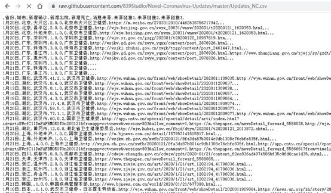

得到的数据呈现这种规格，对于我来说，需要的是第1-6列的数据。由于数据是元数据，如果我需要得到的是某个省份的数据，所以，先获取中国行政区划的信息，将省份信息提取出来，存储在列表province里。因为Pyecharts中去掉了“省”、“自治区”和“市”的部分，将其去掉。

在美数课的数据中，对部分自治州进行了简写，需要对其纠正，通过分析所有数据，将需要纠正的部分写入代码，将其纠正，便于后期和Pyecharts中的数据一一对应。

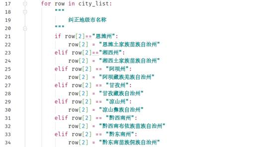

基本的数据处理到此为止。

由于Python默认以字符串读取数据，所以，人数信息都以字符串存储着，需要将其转换为int类型，因为部分数据字段是空，需要简单判断一下数据是否为空，再进行转换，

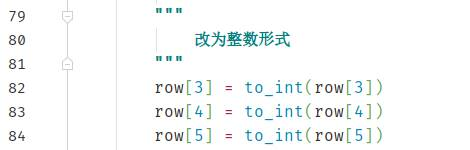

### **数据整合**

将各省的确诊病例、治愈病例和死亡病例整合，最后得出全国信息。

其他图表处理方式类似。

### **数据结构**

China_dict 为字典类，ley是省份，value是有三个元素的列表

Confirm、dead、heal为元素类型为元组的列表：第一个项是省份，第二项是具体的数值。

TIME是字典，key值为省份，value值为一个字典，value对应的字典中，key是地市，value是确诊人数

Time_others_wuhan是一个列表，存储日期、全国其他地区每日确诊人数、湖北地区确诊人数

### 绘图部分

Map

有两种图片标注方式，一种是自定义数据范围

另一种是只设置最大值，自动区间分类

通过tab类，可以使这些图都整合到一个网页上，便于观看

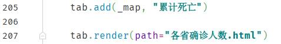

绘制曲线图，将湖北地区的确诊人数和全国其他地区的确诊人数做对比，更直观的反应疫情变化情况

利用Grid类，将L1、L2两部分整合在一起

## 结果展示

全国累计确诊人数

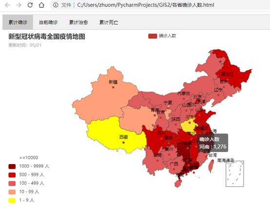

当前确诊人数（截止到20年5月21日）

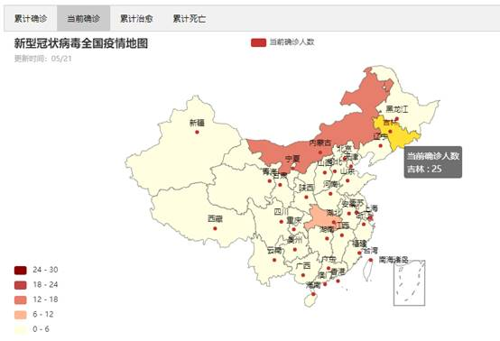

累计治愈人数

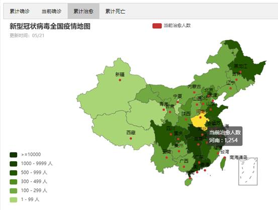

累计死亡

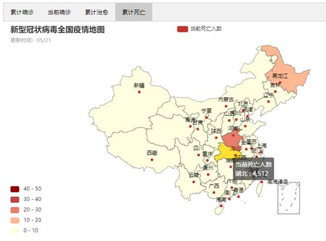

湖北地区和全国其他地区确诊人数对比图（只显示增加部分）

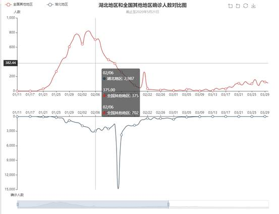

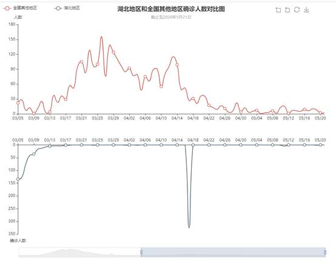

江西省疫情地图

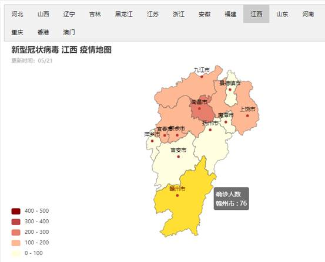

湖北省疫情地图

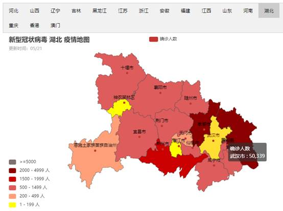

广西省确诊人数

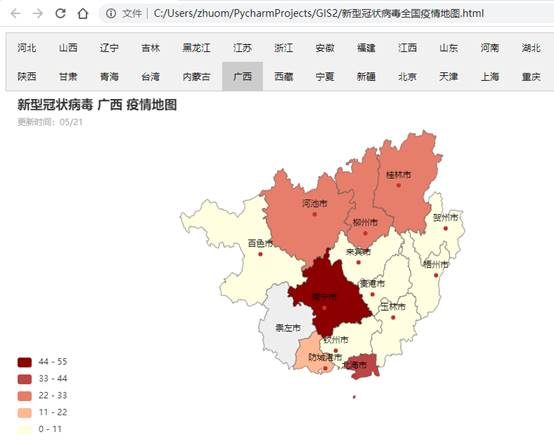

吉林省确诊人数

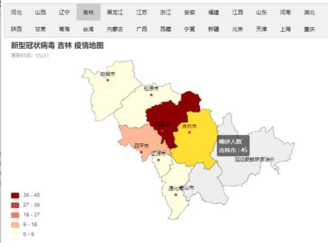

## 心得体会

这次实验算得上是一次全新的体验，之前从未涉及过的领域，所以刚开始有点外行看热闹的意思，不过随着入不断查找资料，渐渐发现这个东西还是很好山手的，因为有强大的开源库来做支持。

在数据获取方面，有过一些困难，但到最后都被克服，总的来说，数据的获取倒不是问题，主要得矛盾在于如何去挖掘这些数据内在的东西，如何通过可视化手段去让人直观了解当前的疫情趋势，这一点是很有必要并且十分重要的。需要多次调试，修改，纠正方案，因为涉及到湖北地区超常规的数据，需要对湖北地区的数据进行特殊处理，不能按照其他省市的常规来操作，给实验增加了工作量。

这次实验总体来说还是比较满意的，但是由于对Python和Pyecharts了解有限，有些数据的处理效率可能会比较低，但是还算是曲线救国，完成了基本的要求。之后可能会继续完善这些代码，让数据展现的更合理，更易于理解，这才是终极目标。

通过这次实验，收获很大，了解到了祖国的大好河山，认识了一些地市的名称，解决了我对于地图可视化的很多疑惑，实验较为满意。

## 参考

> Pyecharts 数据可视化
>
> 参考地区代码：
>
> https://raw.githubusercontent.com/uiwjs/province-city-china/master/dist/city.json
>
> https://juejin.im/post/5de5f42cf265da05c621133a
>
> 省份：
>
> [https://baike.baidu.com/item/%E7%9C%81%E4%BB%BD](https://baike.baidu.com/item/省份)
>
> pyecharts项目
>
> https://pyecharts.org/#/zh-cn/intro
>
> https://github.com/pyecharts/pyecharts
>
> CSV数据
>
> https://raw.githubusercontent.com/839Studio/Novel-Coronavirus-Updates/master/Updates_NC.csv
>
> kesci网
>
> https://www.kesci.com/home/project/5e50e7f50e2b66002c2057b3
>
> 还不错的项目
>
> https://github.com/shadow12138/WuHanGanBaDei
>
> 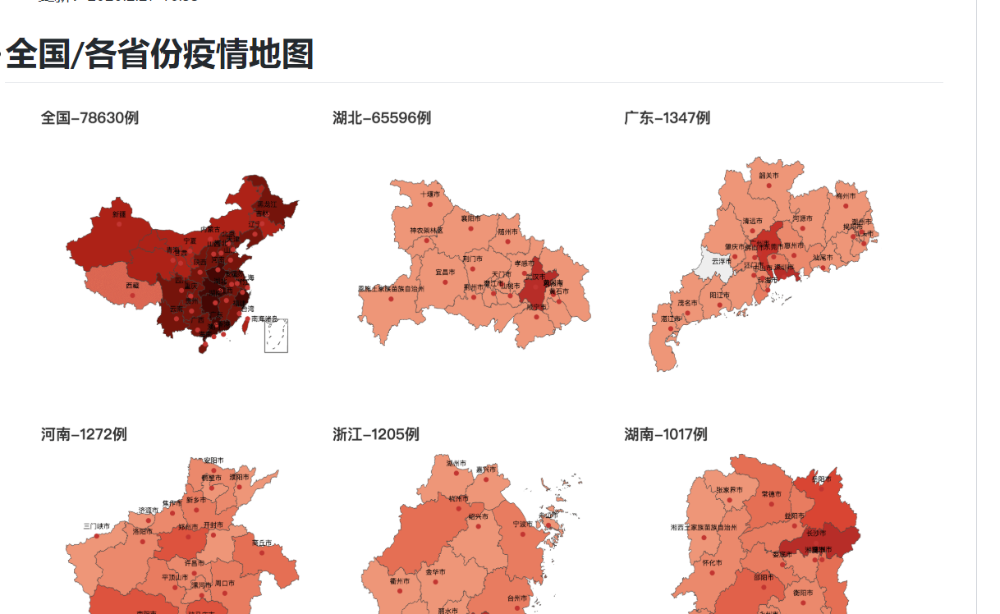
